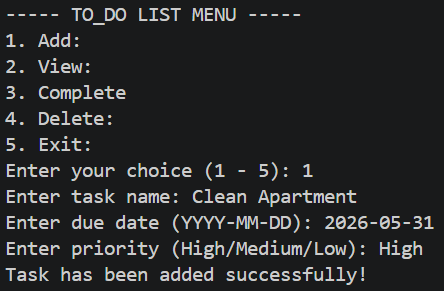
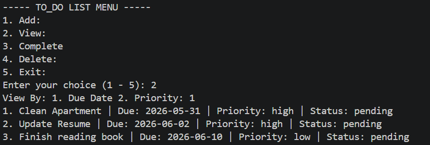
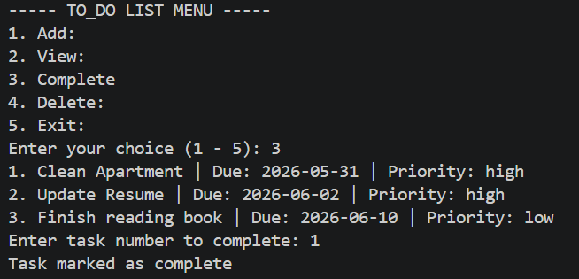
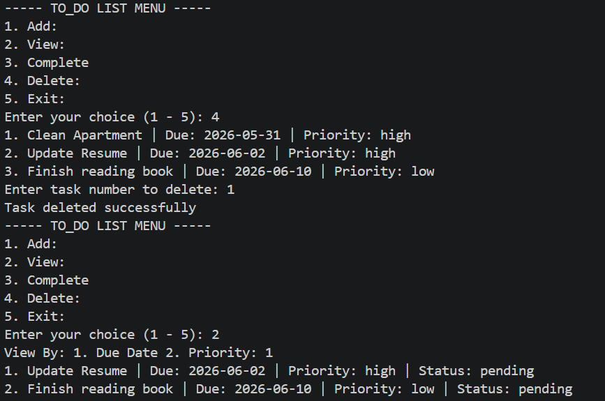

# To-Do List CLI

## About
A command-line task manager built for developers, IT and Computer Science 
students, and anyone who works in the terminal daily. Instead of switching 
to a separate app to manage tasks, this tool lives exactly where you already 
are. Tasks persist between sessions — close the program and your data is 
still there when you come back.

## Features
- **Add tasks** — create a task with a name, due date and priority level
- **View tasks** — display all tasks sorted by due date or priority
- **Complete tasks** — mark a task as complete by selecting its number
- **Delete tasks** — remove a task permanently with a confirmation step
- **Persistent storage** — all tasks saved automatically to a local JSON file

## How to Run

**Requirements:** Python 3 installed on your machine.

**Clone the repository:**
```bash
git clone https://github.com/GeekOryan/to-do-list-cli.git
```

**Navigate into the folder:**
```bash
cd to-do-list-cli
```

**Run the program:**
```bash
python todo.py
```

## Screenshot




## Tech Used
- Python 3
- json module (built-in)
- operator module (built-in)